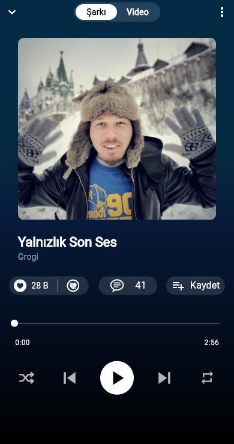

# YouTube Music Clone

Flutter ile geliştirilmiş, YouTube Music uygulamasının **ana ekranını ve müzik
çalar ekranını** taklit eden bir arayüz çalışmasıdır. Amaç, karmaşık bir ticari
uygulamanın ekranlarını Flutter widget ağacıyla yeniden kurmak; kaydırmaya bağlı
app bar geçişleri, Hero animasyonu ve responsive yerleşim gibi konuları
uygulamaktır.

## Ekran görüntüleri

| Açılış ekranı | Ana ekran | Müzik çalar |
| --- | --- | --- |
|  |  |  |

## Ekranlar

- **Açılış ekranı:** Siyah zemin üzerinde YouTube Music logosu; 2 saniye sonra
  ana ekrana geçer.
- **Ana ekran:**
  - Logo, arama ve profil avatarı içeren, kaydırdıkça saydamlaşan app bar
  - Kaydırınca üstte sabitlenen kategori çipleri (Enerjik, Keyifli, Rahatlama…)
  - "Hızlı seçimler": 4 satırlık yatay kaydırmalı şarkı listesi + "Tümünü oynat"
  - "Yeniden dinleyin": 2 satırlık kapak ızgarası
  - "Sizin için derlenenler": oynatma listeleri
  - Aşağı çekince yenileme göstergesi, alt gezinme çubuğu
- **Müzik çalar:** Herhangi bir şarkıya dokununca aşağıdan kayarak açılır; kapak
  görseli karttan çalara **Hero** animasyonuyla taşınır. Üstte Şarkı/Video
  segmentli geçişi, beğeni sayacı ve kısayol düğmeleri (yorum, kaydet, paylaş,
  indir, radyo), sürüklenebilir ilerleme çubuğu ve oynatma kontrolleri bulunur.

Tüm veriler uygulama içinde sabit listelerdir; gerçek müzik çalma yoktur.
Liste yüklemeleri, ağ gecikmesini taklit etmek için 2 saniye bekletilir.

## Proje yapısı

```
lib/
├── main.dart                         # Tema ve uygulama girişi
├── components/                       # Ekranlar arası ortak parçalar
│   ├── bottom_nav_bar.dart
│   ├── other_button.dart             # "Diğer" / "Tümünü oynat" düğmesi
│   ├── playlist_card.dart
│   ├── quick_pick_card.dart          # Hero etiketi taşıyan liste satırı
│   ├── song_card.dart                # Hero etiketi taşıyan kapak kartı
│   └── up_chip.dart                  # Kategori çipleri
├── core/
│   ├── constant/                     # Metin ve renk sabitleri
│   ├── extension/context_extension.dart  # dynamicHeight / dynamicWidth
│   └── operation/general_operation.dart  # Yenileme işlemi
├── features/
│   ├── splash/view/splash_view.dart
│   ├── home/
│   │   ├── view/home_view.dart       # NestedScrollView + sliver başlık
│   │   ├── mixin/home_view_mixin.dart# Kaydırma/opaklık durumu, çaları açma
│   │   ├── appbar/home_app_bar.dart
│   │   ├── delegate/                 # Sabitlenen kategori çubuğu
│   │   └── utilities/                # Gradyanlı arka plan görseli
│   └── player/
│       ├── view/player_view.dart     # Çalar ekranı
│       ├── mixin/player_view_mixin.dart  # Süre/slider mantığı
│       └── widget/                   # Şarkı-Video geçişi, beğeni, kısayollar
└── model/                            # Song, PlayList, Categories
assets/
├── fonts/                            # YouTube Sans ve Roboto
└── images/                           # Logo, arka planlar, kapaklar, avatar
```

## Kullanılan paketler

- `flutter_svg` — SVG logo gösterimi

## Çalıştırma

```bash
flutter pub get
flutter run
```

Uygulama yalnızca dikey yönde çalışır.
