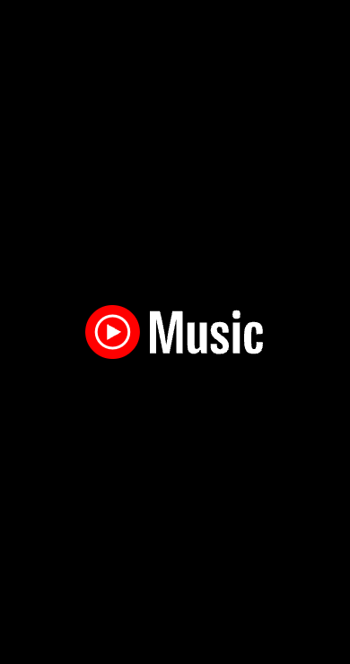
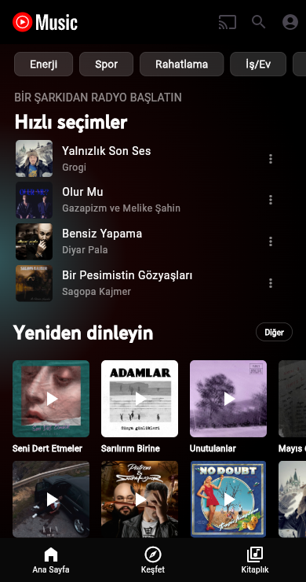
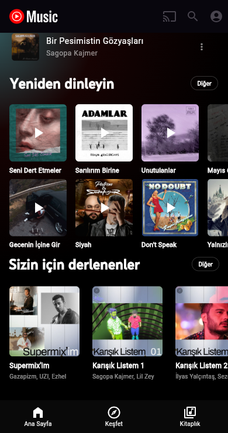

# YouTube Music Clone

Flutter ile geliştirilmiş, YouTube Music uygulamasının ana ekranını birebir taklit
eden bir arayüz çalışmasıdır. Amaç, karmaşık bir ticari uygulamanın ekranını
Flutter widget ağacıyla yeniden kurmak ve farklı ekran boyutlarına uyumlu bir
yerleşim elde etmektir.

## Ekran görüntüleri

| Açılış ekranı | Ana ekran | Ana ekran (kaydırılmış) |
| --- | --- | --- |
|  |  |  |

## Ekranlar

- **Açılış ekranı:** Siyah zemin üzerinde YouTube Music logosu; 2 saniye sonra
  ana ekrana geçer.
- **Ana ekran:**
  - Üstte yatay kaydırılabilir ruh hâli filtreleri (Enerji, Spor, Rahatlama…)
  - "Hızlı seçimler" bölümü: 4 satırlık yatay kaydırmalı şarkı listesi
  - "Yeniden dinleyin" bölümü: 2 satırlık kapak ızgarası
  - "Sizin için derlenenler" bölümü: oynatma listeleri
  - Alt gezinme çubuğu (Ana Sayfa / Keşfet / Kitaplık)

Tüm veriler uygulama içinde sabit listeler olarak tutulur; ağ bağlantısı ya da
gerçek müzik çalma özelliği yoktur. Proje yalnızca arayüz tasarımına odaklanır.

## Proje yapısı

```
lib/
├── main.dart                  # Uygulama girişi, dikey yönlendirme kilidi
├── data/
│   ├── mood_filters.dart      # Üst filtre çipleri
│   └── models/
│       ├── quick_pick.dart    # "Hızlı seçimler" verisi
│       ├── song.dart          # "Yeniden dinleyin" verisi
│       └── playlist.dart      # "Sizin için derlenenler" verisi
└── ui/
    ├── screens/
    │   ├── splash_screen.dart
    │   └── home_screen.dart
    └── widgets/
        └── more_button.dart   # Bölüm başlıklarındaki "Diğer" düğmesi
assets/
├── fonts/                     # YouTube Sans ve Roboto yazı tipleri
└── images/                    # Logo, oynatma listesi ve şarkı kapakları
```

## Kullanılan paketler

- `flutter_svg` — SVG logo gösterimi

## Çalıştırma

```bash
flutter pub get
flutter run
```

Yerleşim, 700 px'ten kısa ve uzun ekranlar için ayrı oranlarla ayarlanmıştır;
uygulama yalnızca dikey yönde çalışır.
